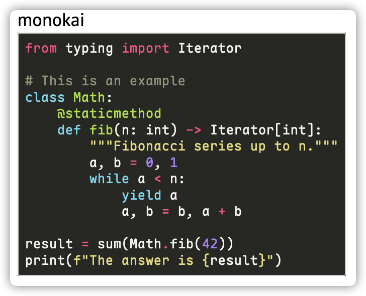

# Advanced Features

YAICLI includes several advanced features to enhance your interaction with AI models.

## Chat Persistent Sessions

YAICLI allows you to save and manage chat sessions:

```bash
# Start a temporary chat session
$ ai --chat

# Start a persistent chat session with a title
$ ai --chat "Python programming help"

# List saved chat sessions
$ ai --list-chats
```

### Managing Chat Sessions

In a chat session, you can use these commands:
- `/save <title>` - Save the current session with a title
- `/list` - List all saved sessions
- `/load <index>` - Load a previously saved session
- `/del <index>` - Delete a saved session

### Persisting Chat Sessions

When you start a chat with a title, the session is automatically saved to disk:

```bash
$ ai --chat "check disk usage"
Chat title: check disk usage
```

The session will be persisted to `CHAT_HISTORY_DIR` by default.

## Role Management

YAICLI supports custom roles to guide AI behavior:

```bash
# Create a new role
ai --create-role "Python Expert"

# List all roles
ai --list-roles

# Show a role
ai --show-role "Python Expert"

# Delete a role
ai --delete-role "Python Expert"

# Use a specific role
ai --role "Python Expert" "How do I use decorators?"
```

## Function Calling

YAICLI supports function calling, enabling AI models to call functions to accomplish tasks:

```bash
# Install default functions
ai --install-functions

# List available functions
ai --list-functions

# Enable function calling in queries
ai 'check the current dir total size' --enable-functions
```

You can also define custom functions by adding them to `~/.config/yaicli/functions/`.

## MCP (Machine Comprehension Protocol)

MCP allows AI models to use external tools:

```bash
# Enable MCP in queries
ai 'What is the latest exchange rate between BTC and USD?' --enable-mcp
```

Configure MCP tools in `~/.config/yaicli/mcp.json`.

## Image Input (Vision)

YAICLI supports sending images to vision-capable models (GPT-4o, Claude 3, Gemini, Llama 3.2 Vision, etc.) using the `--image` / `-i` option.

### Local Images

Pass a local image file path. The image will be validated and base64-encoded before sending:

```bash
ai --image photo.jpg "What is in this image?"
ai -i screenshot.png "Describe the UI layout"
```

Supported formats: JPEG (`.jpg`, `.jpeg`), PNG (`.png`), GIF (`.gif`), WebP (`.webp`).

### URL Images

Pass an image URL to send it directly to the provider:

```bash
ai --image https://example.com/diagram.png "Explain this architecture"
```

### Multiple Images

Use `-i` multiple times to send multiple images in one request:

```bash
ai -i before.png -i after.png "What changed between these two screenshots?"
```

### Image-Only Invocation

You can send an image without a text prompt:

```bash
ai --image photo.jpg
```

### Provider Compatibility

Image input is automatically formatted for each provider family:

| Provider Family | Providers | Image Format |
|----------------|-----------|--------------|
| OpenAI-compatible | OpenAI, DeepSeek, Groq, Mistral, OpenRouter, etc. (~25) | `content` array with `image_url` blocks |
| Anthropic | Anthropic, Anthropic Bedrock, Anthropic Vertex | `content` array with `image` + `source` blocks |
| Gemini | Gemini, Vertex AI | `Part.from_bytes()` / `Part.from_uri()` |
| Ollama | Ollama | Separate `images` array (base64 only) |

Providers without vision support (Cohere, HuggingFace, ChatGLM, ModelScope) will show a warning and send text-only messages.

### Limitations

- Image input is supported in **single-shot mode only**, not in interactive `--chat` mode
- No client-side file size limit; the provider API enforces its own limits
- Ollama may not support URL images; use local files instead
- No automatic image resizing or optimization

## Custom Configuration

### LLM Provider Configuration

YAICLI works with many LLM providers. Configure your preferred provider in the config file:

```ini
[core]
PROVIDER=openai  # or cohere, gemini, ollama, etc.
BASE_URL=        # leave empty for default provider URL
API_KEY=your_api_key_here
MODEL=gpt-4o
```

### Syntax Highlighting Themes

Change the code highlighting theme:

```ini
CODE_THEME = monokai
```

Browse available themes at: https://pygments.org/styles/



### Extra Headers and Body Parameters

Add custom parameters to API requests:

```ini
EXTRA_HEADERS={"X-Extra-Header": "value"}
EXTRA_BODY={"extra_key": "extra_value"}
```

Example for Qwen3's thinking behavior:

```ini
EXTRA_BODY={"enable_thinking": false}
# Or limit thinking tokens:
EXTRA_BODY={"thinking_budget": 4096}
``` 