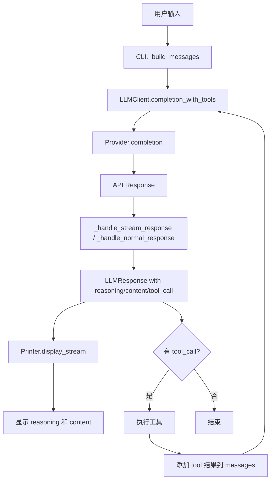
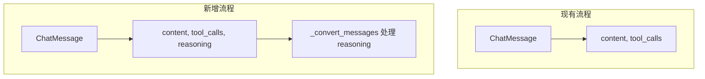
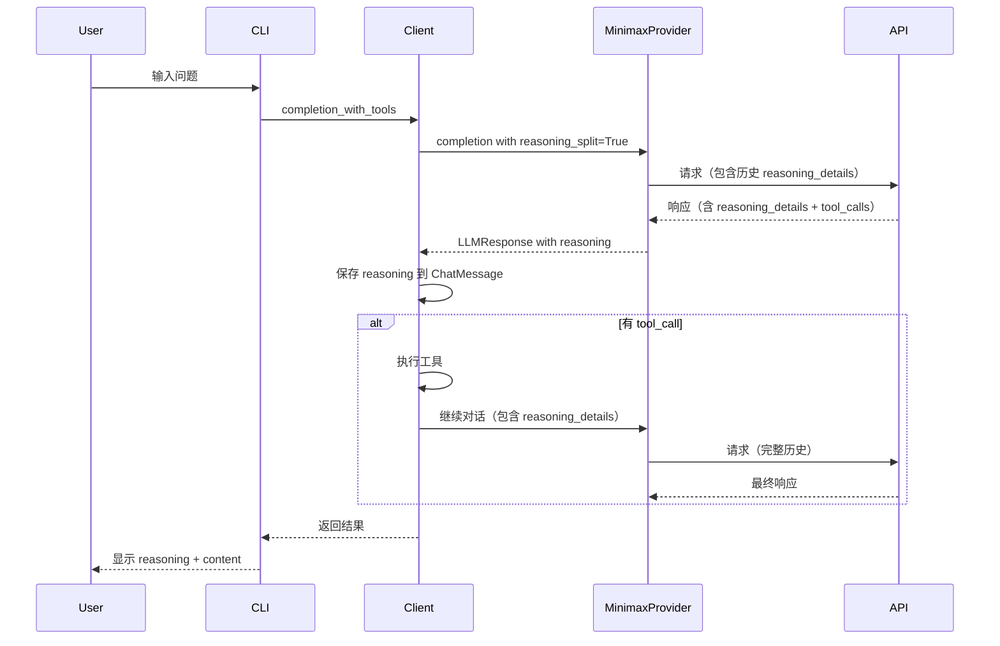
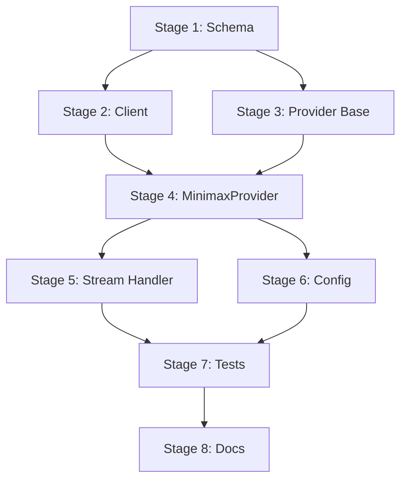

# MiniMax Interleaved Thinking 特性实现计划

## 概述

MiniMax-M2.1 模型原生支持 Interleaved Thinking（交错思维链）特性。该特性允许模型在每轮 Tool Use 前，根据环境或工具的返回进行思考，并决策下一步行动。

### 核心要求

根据 MiniMax 官方文档，实现 Interleaved Thinking 的关键是：**回传每一次模型 Response 的全部信息，尤其是其中的思考字段（`thinking`/`reasoning_details`）**。

## 当前架构分析

### 现有实现

```
yaicli/llms/providers/minimax_provider.py
```

当前 `MinimaxProvider` 继承自 `OpenAIProvider`，仅定义了：
- `DEFAULT_BASE_URL`: MiniMax API 端点
- `COMPLETION_PARAMS_KEYS`: 参数映射（包含 `extra_body`）

### 关键数据流



### 消息历史管理

当前 [`client.py`](yaicli/llms/client.py:91-97) 中，assistant 消息只保存 `content` 和 `tool_calls`：

```python
assistant_message = ChatMessage(
    role="assistant",
    content=assistant_response_content,
    tool_calls=list(tool_calls.values()) if tool_calls else [],
)
```

**问题**：`reasoning` 内容没有被保存到消息历史中，导致多轮 Tool Use 时思维链断裂。

## MiniMax API 特性

### 请求参数

通过 `extra_body` 传递 `reasoning_split=True`：

```python
extra_body={"reasoning_split": True}
```

### 响应格式

启用 `reasoning_split=True` 后，响应中的 `reasoning_details` 字段包含思考内容：

```json
{
    "message": {
        "content": "...",
        "role": "assistant",
        "tool_calls": [...],
        "reasoning_details": [
            {
                "type": "reasoning.text",
                "id": "reasoning-text-1",
                "format": "MiniMax-response-v1",
                "index": 0,
                "text": "思考内容..."
            }
        ]
    }
}
```

### 关键要求

1. **完整回传**：必须将包含 `reasoning_details` 的完整 `response_message` 保留在 Message History 中
2. **思维链连续性**：在下一轮调用中，回传给模型，才能发挥模型的最佳性能

## 实现方案

### 方案选择

**推荐方案**：使用 `reasoning_split=True` 的友好格式

**原因**：
- 无需手动解析 `<think>` 标签
- `reasoning_details` 字段结构清晰
- 便于直接展示和回传

### 架构变更



## 实现阶段

### Stage 1: 扩展 ChatMessage Schema

**目标**：在 `ChatMessage` 中添加 `reasoning` 字段以保存思考内容（与 `LLMResponse.reasoning` 命名保持一致）

**文件**：[`yaicli/schemas.py`](yaicli/schemas.py)

**变更**：

```python
@dataclass
class ChatMessage:
    """Chat message class"""

    role: str
    content: Optional[str] = None
    name: Optional[str] = None
    tool_call_id: Optional[str] = None
    tool_calls: List["ToolCall"] = field(default_factory=list)
    reasoning: Optional[str] = None  # 新增：保存 reasoning 内容
```

**验证标准**：
- 新字段不影响现有功能
- 默认值为 None，向后兼容
- 与 `LLMResponse.reasoning` 命名一致

---

### Stage 2: 更新 LLMClient 保存 reasoning

**目标**：在创建 assistant 消息时保存 reasoning 内容

**文件**：[`yaicli/llms/client.py`](yaicli/llms/client.py)

**变更**：

```python
def completion_with_tools(self, messages, stream=False, recursion_depth=0):
    # ... 现有代码 ...
    
    assistant_response_content = ""
    assistant_reasoning_content = ""  # 新增
    tool_calls: dict[str, ToolCall] = {}

    for llm_response in self.provider.completion(messages, stream=stream):
        yield llm_response
        
        if llm_response.content:
            assistant_response_content += llm_response.content
        if llm_response.reasoning:  # 新增：收集 reasoning
            assistant_reasoning_content += llm_response.reasoning
        if llm_response.tool_call and llm_response.tool_call.id not in tool_calls:
            tool_calls[llm_response.tool_call.id] = llm_response.tool_call

    # 创建 assistant 消息时包含 reasoning
    assistant_message = ChatMessage(
        role="assistant",
        content=assistant_response_content,
        tool_calls=list(tool_calls.values()) if tool_calls else [],
        reasoning=assistant_reasoning_content if assistant_reasoning_content else None,  # 新增
    )
    messages.append(assistant_message)
```

**验证标准**：
- reasoning 内容被正确收集
- assistant 消息包含 reasoning

---

### Stage 3: 更新 Provider 消息转换

**目标**：在 `_convert_messages` 中处理 `reasoning`，将其回传给 API

**文件**：[`yaicli/llms/provider.py`](yaicli/llms/provider.py)

**变更**：

```python
def _convert_messages(self, messages: List[ChatMessage]) -> List[Dict[str, Any]]:
    """Convert a list of ChatMessage objects to a list of OpenAI message format."""
    converted_messages = []
    for msg in messages:
        message: Dict[str, Any] = {"role": msg.role, "content": msg.content or ""}

        if msg.name:
            message["name"] = msg.name

        if msg.role == "assistant" and msg.tool_calls:
            message["tool_calls"] = [
                {"id": tc.id, "type": "function", "function": {"name": tc.name, "arguments": tc.arguments}}
                for tc in msg.tool_calls
            ]

        if msg.role == "tool" and msg.tool_call_id:
            message["tool_call_id"] = msg.tool_call_id

        # 新增：处理 reasoning
        if msg.role == "assistant" and msg.reasoning:
            message["reasoning"] = msg.reasoning

        converted_messages.append(message)

    return converted_messages
```

**注意**：这是基础实现，MiniMax 可能需要特殊格式，将在 Stage 4 中处理。

**验证标准**：
- 转换后的消息包含 reasoning
- 不影响其他 provider 的正常工作

---

### Stage 4: 实现 MinimaxProvider 特定逻辑

**目标**：为 MiniMax 实现专门的消息转换和响应处理

**文件**：[`yaicli/llms/providers/minimax_provider.py`](yaicli/llms/providers/minimax_provider.py)

**变更**：

```python
from typing import Any, Dict, Generator, List, Optional, cast

from openai._streaming import Stream
from openai.types.chat.chat_completion import ChatCompletion
from openai.types.chat.chat_completion_chunk import ChatCompletionChunk

from ...schemas import ChatMessage, LLMResponse, ToolCall
from .openai_provider import OpenAIProvider


class MinimaxProvider(OpenAIProvider):
    """Minimax provider implementation with Interleaved Thinking support"""

    DEFAULT_BASE_URL = "https://api.minimaxi.com/v1"
    COMPLETION_PARAMS_KEYS = {
        "model": "MODEL",
        "temperature": "TEMPERATURE",
        "top_p": "TOP_P",
        "max_tokens": "MAX_TOKENS",
        "timeout": "TIMEOUT",
        "extra_body": "EXTRA_BODY",
        "frequency_penalty": "FREQUENCY_PENALTY",
    }

    def get_completion_params(self) -> Dict[str, Any]:
        """Get completion params with reasoning_split enabled by default."""
        params = super().get_completion_params()
        
        # Ensure extra_body exists and enable reasoning_split
        extra_body = params.get("extra_body", {}) or {}
        if isinstance(extra_body, dict):
            # Only set if not explicitly configured
            if "reasoning_split" not in extra_body:
                extra_body["reasoning_split"] = True
            params["extra_body"] = extra_body
        
        return params

    def _convert_messages(self, messages: List[ChatMessage]) -> List[Dict[str, Any]]:
        """Convert messages with MiniMax-specific reasoning_details format."""
        converted_messages = []
        for msg in messages:
            message: Dict[str, Any] = {"role": msg.role, "content": msg.content or ""}

            if msg.name:
                message["name"] = msg.name

            if msg.role == "assistant" and msg.tool_calls:
                message["tool_calls"] = [
                    {"id": tc.id, "type": "function", "function": {"name": tc.name, "arguments": tc.arguments}}
                    for tc in msg.tool_calls
                ]

            if msg.role == "tool" and msg.tool_call_id:
                message["tool_call_id"] = msg.tool_call_id

            # MiniMax specific: Convert reasoning to reasoning_details format
            if msg.role == "assistant" and msg.reasoning:
                message["reasoning_details"] = [
                    {
                        "type": "reasoning.text",
                        "text": msg.reasoning,
                    }
                ]

            converted_messages.append(message)

        return converted_messages

    def _get_reasoning_content(self, delta: Any) -> Optional[str]:
        """Extract reasoning content from MiniMax response.
        
        MiniMax returns reasoning in reasoning_details field when reasoning_split=True.
        """
        if not delta:
            return None
        if not isinstance(delta, dict):
            delta = dict(delta)
        
        # Check for reasoning_details (MiniMax specific format)
        reasoning_details = delta.get("reasoning_details")
        if reasoning_details and isinstance(reasoning_details, list):
            # Extract text from all reasoning blocks
            texts = []
            for detail in reasoning_details:
                if isinstance(detail, dict) and "text" in detail:
                    texts.append(detail["text"])
            if texts:
                return "".join(texts)
        
        # Fallback to parent implementation for other formats
        return super()._get_reasoning_content(delta)
```

**验证标准**：
- `reasoning_split=True` 默认启用
- 消息转换正确处理 `reasoning_details` 格式
- 响应解析正确提取 reasoning 内容

---

### Stage 5: 处理流式响应中的 reasoning_details

**目标**：确保流式响应中的 `reasoning_details` 被正确解析

**文件**：[`yaicli/llms/providers/minimax_provider.py`](yaicli/llms/providers/minimax_provider.py)

**变更**：在 `_handle_stream_response` 中添加对 `reasoning_details` 的处理（如果需要覆盖父类方法）

```python
def _handle_stream_response(self, response: Stream[ChatCompletionChunk]) -> Generator[LLMResponse, None, None]:
    """Handle streaming response with MiniMax reasoning_details support."""
    tool_call: Optional[ToolCall] = None
    started = False
    
    for chunk in response:
        if not chunk.choices and not started:
            _first_chunk_llm_resp = self._first_chunk_error(chunk)
            if _first_chunk_llm_resp is not None:
                yield _first_chunk_llm_resp
            started = True
            continue

        if not chunk.choices:
            continue
        started = True
        delta = chunk.choices[0].delta
        finish_reason = chunk.choices[0].finish_reason

        content = delta.content or ""
        
        # Extract reasoning from model_extra (where reasoning_details lives)
        model_extra = getattr(delta, "model_extra", None) or {}
        reasoning = self._get_reasoning_content(model_extra)

        if hasattr(delta, "tool_calls") and delta.tool_calls:
            tool_call = self._process_tool_call_chunk(delta.tool_calls, tool_call)

        yield LLMResponse(
            reasoning=reasoning,
            content=content,
            tool_call=tool_call if finish_reason == "tool_calls" else None,
            finish_reason=finish_reason,
        )
```

**验证标准**：
- 流式响应中的 reasoning 被正确提取
- 多轮对话中 reasoning 内容连续

---

### Stage 6: 添加配置选项

**目标**：允许用户通过配置控制 Interleaved Thinking 行为

**文件**：[`yaicli/const.py`](yaicli/const.py)

**变更**：

```python
# 在 DEFAULT_CONFIG_MAP 中添加
"MINIMAX_REASONING_SPLIT": {
    "value": True,
    "env_key": "YAI_MINIMAX_REASONING_SPLIT",
    "type": bool,
},
```

**文件**：[`yaicli/llms/providers/minimax_provider.py`](yaicli/llms/providers/minimax_provider.py)

**变更**：

```python
def get_completion_params(self) -> Dict[str, Any]:
    params = super().get_completion_params()
    
    extra_body = params.get("extra_body", {}) or {}
    if isinstance(extra_body, dict):
        # Use config value, default to True
        reasoning_split = self.config.get("MINIMAX_REASONING_SPLIT", True)
        if "reasoning_split" not in extra_body:
            extra_body["reasoning_split"] = reasoning_split
        params["extra_body"] = extra_body
    
    return params
```

**验证标准**：
- 配置选项可通过环境变量或配置文件设置
- 默认启用 reasoning_split

---

### Stage 7: 单元测试

**目标**：为新功能添加测试覆盖

**文件**：`tests/llms/test_minimax_provider.py`（新建）

**测试用例**：

1. **test_reasoning_split_default_enabled**
   - 验证 `reasoning_split=True` 默认在 extra_body 中

2. **test_convert_messages_with_reasoning**
   - 验证消息转换正确处理 reasoning

3. **test_get_reasoning_content_from_details**
   - 验证从 reasoning_details 格式提取 reasoning

4. **test_stream_response_with_reasoning**
   - 验证流式响应中 reasoning 被正确处理

5. **test_tool_call_with_reasoning_preserved**
   - 验证 tool call 场景下 reasoning 被保留

**验证标准**：
- 所有测试通过
- 覆盖主要功能路径

---

### Stage 8: 文档更新

**目标**：更新 MiniMax provider 文档

**文件**：[`docs/providers/minimax.md`](docs/providers/minimax.md)

**内容**：

1. 说明 Interleaved Thinking 特性
2. 配置选项说明
3. 使用示例
4. 注意事项（如 reasoning 内容会被保存到历史）

**验证标准**：
- 文档清晰说明新特性
- 包含配置示例

## 实现流程图



## 风险与缓解

### 风险 1: 消息历史膨胀

**问题**：保存 reasoning 内容会增加消息历史大小

**缓解**：
- 现有的 `_check_history_len` 机制会自动裁剪历史
- reasoning 内容通常不会特别长

### 风险 2: 其他 Provider 兼容性

**问题**：修改 `ChatMessage` 可能影响其他 provider

**缓解**：
- `reasoning` 字段默认为 None
- 基础 `_convert_messages` 只在有值时添加字段
- 各 provider 可以选择忽略该字段

### 风险 3: API 格式变化

**问题**：MiniMax API 格式可能变化

**缓解**：
- 使用 `_get_reasoning_content` 方法封装解析逻辑
- 便于后续调整

## 测试策略

### 单元测试

- Schema 变更测试
- 消息转换测试
- Reasoning 提取测试

### 集成测试

- 模拟 MiniMax API 响应
- 多轮 Tool Use 场景
- 流式/非流式响应

### 手动测试

1. 配置 MiniMax provider
2. 启用 function calling
3. 发送需要工具调用的请求
4. 验证 reasoning 显示和保留

## 依赖关系



## 总结

本计划通过以下步骤实现 MiniMax Interleaved Thinking 支持：

1. 扩展 `ChatMessage` 以保存 reasoning 内容
2. 更新 `LLMClient` 收集和保存 reasoning
3. 实现 MiniMax 特定的消息转换和响应解析
4. 添加配置选项和测试
5. 更新文档

核心原则是**保持思维链的连续性**，确保每轮对话的 reasoning 内容都被完整保存和回传。

